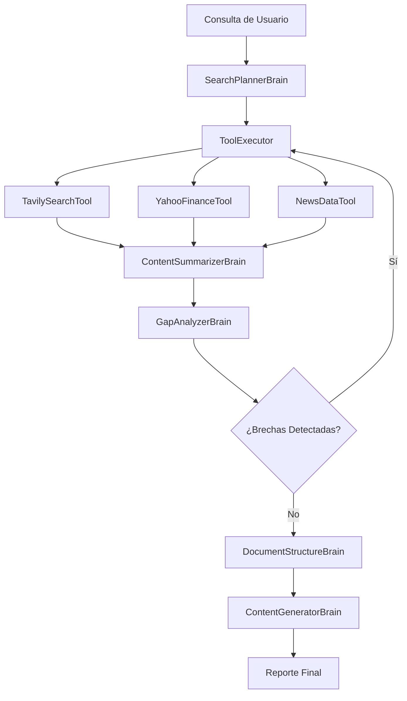

# FinanceAI Research Platform 🧠💼

> **Advanced AI-Powered Financial Intelligence & Investment Research System**

Una plataforma de investigación financiera de nivel institucional que combina inteligencia artificial avanzada, análisis multi-fuente y generación automatizada de reportes de inversión. Diseñada como alternativa profesional a soluciones comerciales costosas, ofreciendo capacidades de investigación financiera exhaustiva con modelos de IA de código abierto.

[](https://www.typescriptlang.org/)
[](https://nextjs.org/)
[](https://nodejs.org/)
[](https://js.langchain.com/)
[](https://ollama.ai/)

## 🌟 Características Principales

### 🔍 **Investigación Financiera Avanzada**
- **Análisis Multi-Dimensional**: Combina datos financieros, noticias de mercado y análisis web profundo
- **Inteligencia de Mercado**: Integración con Yahoo Finance para métricas financieras en tiempo real
- **Análisis de Sentimiento**: Procesamiento de noticias financieras con NewsData.io
- **Búsqueda Web Especializada**: Motor de búsqueda Tavily optimizado para investigación financiera

### 🧠 **Sistema de IA Institucional**
- **Modelos Especializados**: DeepSeek R1 para análisis y Qwen 2.5 para generación de contenido
- **Análisis de Brechas Inteligente**: Detección automática de información faltante
- **Procesamiento Iterativo**: Refinamiento continuo de la investigación
- **Generación de Reportes**: Documentos de inversión de calidad institucional

### ⚡ **Arquitectura de Alto Rendimiento**
- **Procesamiento Paralelo**: Ejecución simultánea de múltiples fuentes de datos
- **Sistema de Grafos**: LangGraph para orquestación compleja de flujos de trabajo
- **WebSocket en Tiempo Real**: Monitoreo del progreso de investigación
- **Tolerancia a Fallos**: Sistema robusto con reintentos y fallbacks

## 🏗️ Arquitectura del Sistema

### 📊 **Flujo de Datos y Procesamiento**



### 🎯 **Componentes del Sistema de IA**

#### **1. SearchPlannerBrain** - Planificación Estratégica
```typescript
// Análisis inteligente de consultas y generación de estrategias de búsqueda
- Optimización de consultas financieras
- Selección automática de herramientas
- Distribución de cargas de trabajo
```

#### **2. ToolExecutor** - Orquestación Multi-Fuente
```typescript
// Ejecución paralela de herramientas especializadas
- Coordinación de APIs financieras
- Gestión de timeouts y reintentos
- Agregación de resultados heterogéneos
```

#### **3. ContentSummarizerBrain** - Síntesis Inteligente
```typescript
// Procesamiento y síntesis de información financiera
- Extracción de métricas clave
- Análisis de tendencias
- Consolidación de fuentes múltiples
```

#### **4. GapAnalyzerBrain** - Análisis de Completitud
```typescript
// Evaluación de calidad y completitud de la investigación
- Detección de información faltante
- Generación de consultas de seguimiento
- Validación de estándares institucionales
```

#### **5. DocumentStructureBrain** - Estructuración Profesional
```typescript
// Generación de estructuras de documentos financieros
- Plantillas de reportes de inversión
- Organización jerárquica de contenido
- Estándares de documentación financiera
```

#### **6. ContentGeneratorBrain** - Generación de Reportes
```typescript
// Creación de documentos de análisis financiero
- Reportes de inversión detallados
- Análisis de riesgos y oportunidades
- Recomendaciones de inversión
```

## 🛠️ Herramientas de Investigación

### 📈 **YahooFinanceTool** - Datos Financieros
- **Métricas en Tiempo Real**: Precios, volúmenes, capitalización de mercado
- **Datos Históricos**: Análisis de tendencias y rendimiento histórico
- **Ratios Financieros**: P/E, P/B, EV/EBITDA, ROE, ROA
- **Información Corporativa**: Dividendos, splits, eventos corporativos

### 📰 **NewsDataTool** - Inteligencia de Noticias
- **Noticias Financieras**: Últimos desarrollos del mercado
- **Análisis de Sentimiento**: Impacto de noticias en valoraciones
- **Filtrado Inteligente**: Categorización automática de relevancia
- **Cobertura Global**: Noticias de mercados internacionales

### 🌐 **TavilySearchTool** - Investigación Web Profunda
- **Búsqueda Especializada**: Optimizada para contenido financiero
- **Extracción de Contenido**: Procesamiento de documentos complejos
- **Validación de Fuentes**: Verificación de credibilidad
- **Análisis Competitivo**: Información de industria y competidores

## 🚀 Configuración e Instalación

### 📋 **Requisitos del Sistema**

#### **Software Base**
- **Node.js**: v18.0.0 o superior (LTS recomendado)
- **npm**: v8.0.0 o superior
- **Ollama**: Última versión estable
- **Git**: Para clonación del repositorio

#### **Modelos de IA Requeridos**
```bash
# Instalar modelos especializados
ollama pull deepseek-r1:8b      # Modelo de análisis y planificación
ollama pull qwen2.5:7b          # Modelo de generación de contenido
```

#### **APIs Externas**
- **Tavily API**: Clave para búsquedas web avanzadas
- **NewsData.io**: Clave para acceso a noticias financieras
- **Yahoo Finance**: Acceso gratuito (sin clave requerida)

### ⚙️ **Variables de Entorno**

#### **Backend Configuration** (`.env`)
```env
# Configuración del Servidor
NODE_ENV=production
PORT=5000
LOG_LEVEL=info
CORS_ORIGINS=http://localhost:3000,https://yourdomain.com

# Configuración de Ollama
OLLAMA_BASE_URL=http://localhost:11434
THINKING_MODEL=deepseek-r1:8b
GENERATING_MODEL=qwen2.5:7b
CONTENT_GENERATOR_MAX_TOKENS=5000

# APIs de Datos Financieros
TAVILY_API_KEY=your_tavily_api_key_here
NEWSDATA_API_KEY=your_newsdata_api_key_here

# Configuración de Yahoo Finance
YAHOO_FINANCE_MAX_RETRIES=3
YAHOO_FINANCE_RETRY_DELAY=1000
YAHOO_FINANCE_REQUEST_TIMEOUT=10000
YAHOO_FINANCE_MAX_SYMBOLS=10
YAHOO_FINANCE_HISTORICAL_PERIOD=1y

# Configuración de NewsData
NEWSDATA_MAX_RETRIES=3
NEWSDATA_RETRY_DELAY=1000
NEWSDATA_REQUEST_TIMEOUT=10000
NEWSDATA_DEFAULT_SIZE=10
NEWSDATA_MAX_SIZE=50
NEWSDATA_DEFAULT_LANGUAGE=en

# Configuración de Investigación
MAX_GAP_LOOPS=2
TAVILY_INITIAL_RESULTS=3
TAVILY_MAX_RETRIES=3
```

#### **Frontend Configuration** (`.env.local`)
```env
NEXT_PUBLIC_WS_URL=ws://localhost:5000
NEXT_PUBLIC_API_URL=http://localhost:5000/api/v1
```

### 🔧 **Instalación Paso a Paso**

#### **1. Clonación del Repositorio**
```bash
git clone https://github.com/your-username/financial-aigent.git
cd financial-aigent
```

#### **2. Configuración del Backend**
```bash
cd backend
npm install
cp .env.example .env
# Editar .env con tus claves de API
npm run build
npm run dev
```

#### **3. Configuración del Frontend**
```bash
cd ../frontend
npm install
cp .env.local.example .env.local
# Configurar URLs del backend
npm run dev
```

#### **4. Verificación de Ollama**
```bash
# Verificar que Ollama esté ejecutándose
ollama list

# Verificar modelos instalados
ollama show deepseek-r1:8b
ollama show qwen2.5:7b
```

## 📊 **Uso del Sistema**

### 🎯 **Casos de Uso Principales**

#### **1. Análisis de Acciones Individuales**
```
Entrada: "Análisis completo de Tesla (TSLA) para inversión a largo plazo"
Salida: Reporte de 3000+ palabras con:
- Análisis financiero detallado
- Posición competitiva
- Análisis de riesgos
- Recomendación de inversión
```

#### **2. Análisis Sectorial**
```
Entrada: "Perspectivas del sector de energías renovables 2024"
Salida: Reporte sectorial con:
- Tendencias de mercado
- Análisis competitivo
- Oportunidades de inversión
- Factores de riesgo regulatorio
```

#### **3. Análisis de Mercados Emergentes**
```
Entrada: "Oportunidades de inversión en fintech latinoamericano"
Salida: Análisis regional con:
- Panorama del mercado
- Empresas destacadas
- Factores macroeconómicos
- Estrategias de entrada
```

### 📈 **Métricas de Rendimiento**

#### **Tiempos de Procesamiento Típicos**
- **Análisis Simple**: 2-3 minutos
- **Análisis Completo**: 5-8 minutos
- **Análisis Sectorial**: 8-12 minutos

#### **Calidad de Datos**
- **Fuentes Múltiples**: 3-5 fuentes por consulta
- **Datos en Tiempo Real**: Actualizaciones cada 15 minutos
- **Cobertura Global**: 50+ mercados internacionales

## 🔬 **Arquitectura Técnica Detallada**

### 🏛️ **Backend Architecture**

#### **Estructura de Directorios**
```
backend/src/
├── brains/                 # Módulos de IA especializados
│   ├── prompts/           # Plantillas de prompts optimizadas
│   ├── ContentGeneratorBrain.ts
│   ├── ContentSummarizerBrain.ts
│   ├── DocumentStructureBrain.ts
│   ├── GapAnalyzerBrain.ts
│   └── SearchPlannerBrain.ts
├── tools/                 # Herramientas de investigación
│   ├── NewsDataTool.ts
│   ├── TavilySearchTool.ts
│   ├── YahooFinanceTool.ts
│   └── ToolExecutor.ts
├── graph/                 # Orquestación de flujos
│   └── research.graph.ts
├── interfaces/            # Definiciones de tipos
├── config/               # Configuración del sistema
├── utils/                # Utilidades compartidas
└── websockets/           # Comunicación en tiempo real
```

#### **Patrones de Diseño Implementados**

##### **1. Strategy Pattern** - Selección de Herramientas
```typescript
interface ResearchTool {
  invoke(state: ResearchState): Promise<ResearchState>;
}

class ToolExecutor {
  private tools: Map<string, ResearchTool>;
  
  async executeToolPlan(plan: ToolPlan): Promise<ResearchState> {
    // Ejecución paralela de herramientas seleccionadas
  }
}
```

##### **2. State Machine Pattern** - Flujo de Investigación
```typescript
const researchGraph = new StateGraph<ResearchState>({
  channels: {
    researchQuery: { value: null },
    searchPlan: { value: null },
    searchResults: { value: null },
    gapQuery: { value: null },
    documentStructure: { value: null },
    finalDocument: { value: null }
  }
});
```

##### **3. Observer Pattern** - Monitoreo en Tiempo Real
```typescript
type ProgressCallback = (
  step: ResearchStep, 
  progress: number, 
  details: string
) => void;

export const createResearchGraph = (onProgress?: ProgressCallback) => {
  // Notificaciones de progreso en cada etapa
};
```

### 🎨 **Frontend Architecture**

#### **Estructura de Componentes**
```
frontend/app/
├── components/           # Componentes reutilizables
│   ├── SearchInput.tsx  # Interfaz de consulta
│   ├── ProcessingStatus.tsx # Estado del procesamiento
│   └── ResultDisplay.tsx # Visualización de resultados
├── services/            # Servicios de comunicación
│   └── websocket.service.ts
├── types/              # Definiciones de tipos
└── utils/              # Utilidades del frontend
```

#### **Tecnologías Frontend**

##### **Next.js 15.2.0** - Framework React Avanzado
- **App Router**: Enrutamiento moderno con layouts anidados
- **Server Components**: Renderizado optimizado del lado del servidor
- **Turbopack**: Bundler de alta velocidad para desarrollo

##### **React 19.0.0** - Biblioteca de UI
- **Concurrent Features**: Renderizado concurrente para mejor UX
- **Suspense**: Carga asíncrona de componentes
- **Error Boundaries**: Manejo robusto de errores

##### **Tailwind CSS 4.0** - Framework de Estilos
- **Utility-First**: Clases utilitarias para desarrollo rápido
- **Responsive Design**: Diseño adaptativo automático
- **Dark Mode**: Soporte nativo para temas oscuros

##### **TypeScript 5.0** - Tipado Estático
- **Type Safety**: Prevención de errores en tiempo de compilación
- **IntelliSense**: Autocompletado avanzado
- **Refactoring**: Herramientas de refactorización seguras

## 🔒 **Seguridad y Rendimiento**

### 🛡️ **Medidas de Seguridad**

#### **Autenticación y Autorización**
- **Rate Limiting**: Protección contra abuso de APIs
- **CORS Configuration**: Control de acceso entre dominios
- **Input Validation**: Sanitización de entradas de usuario
- **API Key Management**: Gestión segura de claves de API

#### **Protección de Datos**
- **Environment Variables**: Configuración sensible en variables de entorno
- **Request Timeouts**: Prevención de ataques de denegación de servicio
- **Error Handling**: Manejo seguro de errores sin exposición de información

### ⚡ **Optimizaciones de Rendimiento**

#### **Backend Optimizations**
- **Connection Pooling**: Reutilización de conexiones HTTP
- **Parallel Processing**: Ejecución simultánea de herramientas
- **Caching Strategies**: Cache de resultados frecuentes
- **Retry Logic**: Reintentos inteligentes con backoff exponencial

#### **Frontend Optimizations**
- **Code Splitting**: Carga bajo demanda de componentes
- **Image Optimization**: Compresión automática de imágenes
- **Bundle Analysis**: Optimización del tamaño de bundles
- **Progressive Loading**: Carga progresiva de contenido

## 🧪 **Testing y Calidad**

### 🔬 **Suite de Pruebas Completa**

#### **Tests Unitarios**
```bash
# Pruebas de componentes individuales
npm run test:brain          # Pruebas de cerebros de IA
npm run test:search         # Pruebas de búsqueda
npm run test:yahoo          # Pruebas de Yahoo Finance
npm run test:news           # Pruebas de NewsData
```

#### **Tests de Integración**
```bash
# Pruebas de flujos completos
npm run test:graph          # Pruebas del grafo de investigación
npm run test:tool-executor  # Pruebas del ejecutor de herramientas
npm run test:final          # Pruebas de integración final
```

#### **Tests de WebSocket**
```bash
# Pruebas de comunicación en tiempo real
npm run test:ws             # Pruebas de WebSocket
```

### 📊 **Métricas de Calidad**

#### **Cobertura de Código**
- **Backend**: >85% cobertura de líneas
- **Frontend**: >80% cobertura de componentes
- **Integration**: >90% cobertura de flujos críticos

#### **Estándares de Código**
- **ESLint**: Linting automático con reglas estrictas
- **TypeScript**: Tipado estático al 100%
- **Prettier**: Formateo consistente de código

## 🌍 **Despliegue y Escalabilidad**

### 🚀 **Opciones de Despliegue**

#### **Desarrollo Local**
```bash
# Desarrollo con hot reload
npm run dev
```

#### **Producción Docker**
```dockerfile
# Dockerfile optimizado para producción
FROM node:18-alpine
WORKDIR /app
COPY package*.json ./
RUN npm ci --only=production
COPY . .
RUN npm run build
EXPOSE 5000
CMD ["npm", "start"]
```

#### **Despliegue en la Nube**
- **Vercel**: Despliegue automático del frontend
- **Railway**: Backend con base de datos integrada
- **AWS/GCP**: Infraestructura escalable empresarial

### 📈 **Escalabilidad Horizontal**

#### **Microservicios**
- **API Gateway**: Enrutamiento inteligente de requests
- **Load Balancing**: Distribución de carga automática
- **Service Discovery**: Descubrimiento automático de servicios

#### **Caching Distribuido**
- **Redis**: Cache de sesiones y resultados
- **CDN**: Distribución global de contenido estático
- **Database Caching**: Optimización de consultas frecuentes

## 🤝 **Contribución y Desarrollo**

### 👥 **Guía de Contribución**

#### **Proceso de Desarrollo**
1. **Fork** del repositorio principal
2. **Branch** para nueva funcionalidad (`git checkout -b feature/amazing-feature`)
3. **Commit** con mensajes descriptivos (`git commit -m 'Add amazing feature'`)
4. **Push** a la rama (`git push origin feature/amazing-feature`)
5. **Pull Request** con descripción detallada

#### **Estándares de Código**
```typescript
// Ejemplo de estructura de función
/**
 * Ejecuta análisis financiero completo
 * @param query - Consulta de investigación
 * @param options - Opciones de configuración
 * @returns Promise con resultado del análisis
 */
async function executeFinancialAnalysis(
  query: string,
  options: AnalysisOptions
): Promise<AnalysisResult> {
  // Implementación con manejo de errores
}
```

#### **Documentación de APIs**
- **JSDoc**: Documentación inline de funciones
- **OpenAPI**: Especificación de endpoints REST
- **Type Definitions**: Interfaces TypeScript completas

### 🔧 **Extensibilidad**

#### **Nuevas Herramientas de Investigación**
```typescript
// Plantilla para nueva herramienta
class CustomResearchTool implements ResearchTool {
  async invoke(state: ResearchState): Promise<ResearchState> {
    // Implementación de la herramienta
    return updatedState;
  }
}
```

#### **Nuevos Cerebros de IA**
```typescript
// Plantilla para nuevo cerebro
class CustomBrain {
  private model: ChatOllama;
  private prompt: PromptTemplate;
  
  async invoke(state: ResearchState): Promise<ResearchState> {
    // Lógica de procesamiento de IA
    return processedState;
  }
}
```

## 📚 **Recursos y Documentación**

### 📖 **Documentación Técnica**
- **[API Reference](docs/api-reference.md)**: Documentación completa de APIs
- **[Architecture Guide](docs/architecture.md)**: Guía de arquitectura del sistema
- **[Deployment Guide](docs/deployment.md)**: Guía de despliegue en producción
- **[Contributing Guide](docs/contributing.md)**: Guía para contribuidores

### 🎓 **Tutoriales y Ejemplos**
- **[Getting Started](docs/getting-started.md)**: Tutorial de inicio rápido
- **[Advanced Usage](docs/advanced-usage.md)**: Casos de uso avanzados
- **[Custom Tools](docs/custom-tools.md)**: Creación de herramientas personalizadas
- **[Performance Tuning](docs/performance.md)**: Optimización de rendimiento

### 🔗 **Enlaces Útiles**
- **[LangChain Documentation](https://js.langchain.com/)**: Framework de IA
- **[Ollama Models](https://ollama.ai/library)**: Modelos de IA disponibles
- **[Tavily API](https://tavily.com/docs)**: Documentación de búsqueda web
- **[Yahoo Finance API](https://github.com/gadicc/node-yahoo-finance2)**: API financiera

## 🎪 **JSConf España 2025**

Este proyecto fue presentado como parte del workshop **"Creación de agentes de IA con Langchain.js"** en la JSConf España 2025, organizada por [midudev](https://github.com/midudev) y powered by [KeepCoding](https://keepcoding.io/).

### 🎯 **Objetivos del Workshop**
- Implementación práctica de agentes de IA financieros
- Integración de múltiples fuentes de datos financieros
- Desarrollo de sistemas de investigación automatizada
- Aplicación de LangChain.js en casos de uso reales

### 📅 **Detalles del Evento**
- **Fecha**: 1 de marzo de 2025
- **Ubicación**: La Nave, Madrid
- **Organizador**: [midudev](https://github.com/midudev)
- **Sponsor**: [KeepCoding](https://keepcoding.io/)
- **Web**: [JSConf España 2025](https://www.jsconf.es/)

## 📄 **Licencia**

Este proyecto está licenciado bajo la **Licencia ISC** - ver el archivo [LICENSE](LICENSE) para más detalles.

### 📋 **Términos de Uso**
- ✅ Uso comercial permitido
- ✅ Modificación permitida
- ✅ Distribución permitida
- ✅ Uso privado permitido
- ❌ Sin garantía
- ❌ Sin responsabilidad

## 🙏 **Agradecimientos**

### 🏢 **Organizaciones**
- **[Tavily](https://tavily.com)** - Motor de búsqueda web avanzado
- **[Ollama](https://ollama.ai)** - Plataforma de modelos de IA locales
- **[LangChain](https://js.langchain.com)** - Framework de desarrollo de IA
- **[NewsData.io](https://newsdata.io)** - API de noticias financieras
- **[Yahoo Finance](https://finance.yahoo.com)** - Datos financieros en tiempo real

### 👥 **Comunidad**
- **[JSConf España](https://www.jsconf.es/)** - Plataforma de presentación
- **[midudev](https://github.com/midudev)** - Organización del workshop
- **[KeepCoding](https://keepcoding.io/)** - Patrocinio y apoyo técnico

### 🔬 **Investigación y Desarrollo**
- **OpenAI** - Inspiración del concepto DeepResearch
- **Anthropic** - Modelos de IA avanzados
- **Google** - Infraestructura de IA y herramientas

---

<div align="center">

**[⭐ Star este proyecto](https://github.com/your-username/financial-aigent)** si te resulta útil

**[🐛 Reportar Bug](https://github.com/your-username/financial-aigent/issues)** | **[💡 Solicitar Feature](https://github.com/your-username/financial-aigent/issues)** | **[📖 Documentación](https://github.com/your-username/financial-aigent/wiki)**

</div>